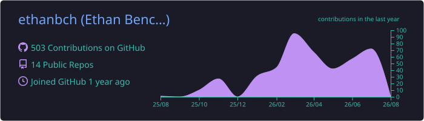
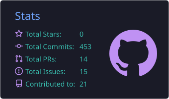
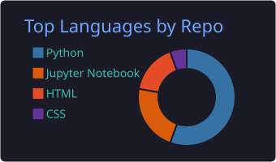
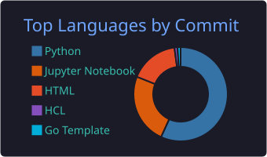

  <h1>Ethan Benchetrit</h1>
  
<b>AI Engineer & Data Scientist</b>

  

    
    
    
  

---

### 🛠️ Tech Stack

<table>
  <tr>
    <td width="30%"><b>AI & Data Science</b></td>
    <td>
      
      
      
      
      
    </td>
  </tr>
  <tr>
    <td width="30%"><b>Cloud & MLOps</b></td>
    <td>
      
      
      
      
    </td>
  </tr>
  <tr>
    <td width="30%"><b>Software Engineering</b></td>
    <td>
      
      
      
    </td>
  </tr>
</table>

---

### 📊 Activity & Performance

<table align="center" border="0">
  <tr>
    <td width="50%" align="center">
      
    </td>
    <td width="50%" align="center">
      
    </td>
  </tr>
  <tr>
    <td width="50%" align="center">
      
    </td>
    <td width="50%" align="center">
      
    </td>
  </tr>
</table>
